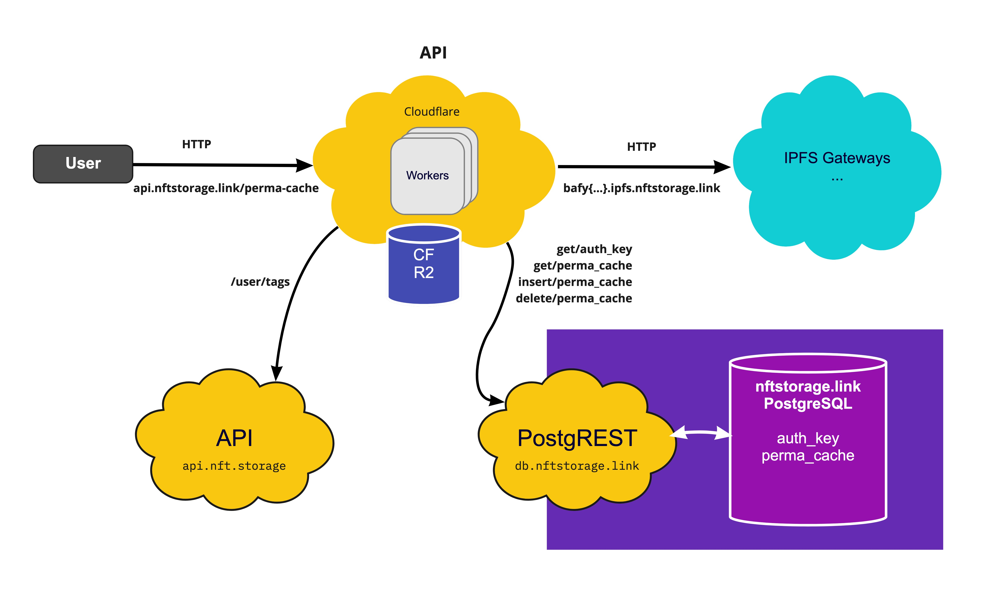

# nftstorage.link API

> The API for nftstorage.link provides a perma-cache layer for super fast content addressing retrieval.

## Getting started

One time set up of your cloudflare worker subdomain for dev:

- `pnpm install` - Install the project dependencies from the monorepo root directory
- Sign up to Cloudflare and log in with your default browser.
- `npm i @cloudflare/wrangler -g` - Install the Cloudflare wrangler CLI
- `wrangler login` - Authenticate your wrangler cli; it'll open your browser.
- Copy your cloudflare account id from `wrangler whoami`
- Update `wrangler.toml` with a new `env`. Set your env name to be the value of `whoami` on your system you can use `pnpm start` to run the worker in dev mode for you.

  [**wrangler.toml**](./wrangler.toml)

  ```toml
  [env.bobbytables]
  workers_dev = true
  account_id = "<what does the `wrangler whoami` say>"
  ```

- Add secrets

  ```sh
    wrangler secret put SENTRY_DSN --env $(whoami) # Get from Sentry (not required for dev)
    wrangler secret put LOGTAIL_TOKEN --env $(whoami) # Get from Logtail
    wrangler secret put DATABASE_TOKEN --env $(whoami) # Get from database account
  ```

- Add R2 bucket (Note that it is only available as Private Beta at the time of writing)

  ```sh
  wrangler r2 bucket create super-hot --env $(whoami)
  # 🌀  Creating bucket "super-hot"
  # ✨  Success!
  ```

- `pnpm run publish` - Publish the worker under your env. An alias for `wrangler publish --env $(whoami)`
- `pnpm start` - Run the worker in dev mode. An alias for `wrangler dev --env $(whoami)`

You only need to `pnpm start` for subsequent runs. PR your env config to the `wrangler.toml` to celebrate 🎉

## High level architecture

The HTTP API to optimize content retrieval from nftstorage.link IPFS gateway. It is serverless code running across the globe to write content into our Cloud storage, and consequently offering lightning fast content retrieval.



## Usage

As a requirement, you need an account in https://nft.storage and access granted to the feature (at the time of writing). With that, you can simply create an API key and you are ready to go.
To get access to this feature you can get more information at https://nftstorage.link.

You can see full HTTP API specification at https://nftstorage.link/api-docs.

### 🔒 `POST /perma-cache/:url`

> Perma-cache a URL for fast retrieval.

```console
$ curl -X POST -H 'Authorization: Bearer YOUR_API_KEY' https://api.nftstorage.link/perma-cache/https%3A%2F%2Fbafkreidyeivj7adnnac6ljvzj2e3rd5xdw3revw4da7mx2ckrstapoupoq.ipfs.nftstorage.link%2F -s | jq
{
  "url": "http://bafkreidyeivj7adnnac6ljvzj2e3rd5xdw3revw4da7mx2ckrstapoupoq.ipfs.nftstorage.link/"
  "size": 28
  "inserted_at" "2022-05-18T11:37:27.878372"
}
```

Notes:

- During open beta is limited on a File size of `4.995 GB`
- Content types `text/json`, `text/html` and `image/svg+xml` are limited to `120 MB` during the near future.

### 🔒 `DELETE /perma-cache/:url`

> Delete a given URL from perma-cache.

```console
$ curl -X DELETE -H 'Authorization: Bearer YOUR_API_KEY' https://api.nftstorage.link/perma-cache/https%3A%2F%2Fbafkreidyeivj7adnnac6ljvzj2e3rd5xdw3revw4da7mx2ckrstapoupoq.ipfs.nftstorage.link%2F -s | jq
true
```

Please note that this will not remove the content from the IPFS network nor other caching layers.

### 🔒 `GET /perma-cache/`

> Get all user perma-cache URLs.

```console
$ curl -X GET -H 'Authorization: Bearer YOUR_API_KEY' https://api.nftstorage.link/perma-cache -s | jq
[
  {
    "url": "http://bafkreidyeivj7adnnac6ljvzj2e3rd5xdw3revw4da7mx2ckrstapoupoq.ipfs.nftstorage.link/"
    "size": 28
    "inserted_at": "2022-05-18T11:37:27.878372"
  }
]
```

### 🔒 `GET /perma-cache/status`

> Get perma-cache account status.

```console
$ curl -X GET -H 'Authorization: Bearer YOUR_API_KEY' https://api.nftstorage.link/perma-cache/status -s | jq
{
  "usedStorage": "8036759278"
}
```

### Rate limiting

nft.storage Gateway is currently rate limited at 100 requests per minute to a given IP Address. In the event of a rate limit, the IP will be blocked for 30 seconds.
