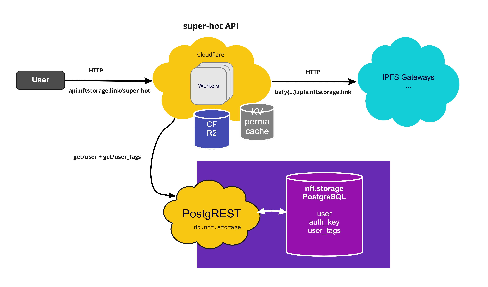

# nftstorage.link API

> The API for nftstorage.link provides a perma-cache layer for super fast content addressing retrieval.

## Getting started

One time set up of your cloudflare worker subdomain for dev:

- `pnpm install` - Install the project dependencies from the monorepo root directory
- Sign up to Cloudflare and log in with your default browser.
- `npm i @cloudflare/wrangler -g` - Install the Cloudflare wrangler CLI
- `wrangler login` - Authenticate your wrangler cli; it'll open your browser.
- Copy your cloudflare account id from `wrangler whoami`
- Update `wrangler.toml` with a new `env`. Set your env name to be the value of `whoami` on your system you can use `pnpm start` to run the worker in dev mode for you.

  [**wrangler.toml**](./wrangler.toml)

  ```toml
  [env.bobbytables]
  workers_dev = true
  account_id = "<what does the `wrangler whoami` say>"
  ```

- Add secrets

  ```sh
    wrangler secret put SENTRY_DSN --env $(whoami) # Get from Sentry (not required for dev)
    wrangler secret put LOGTAIL_TOKEN --env $(whoami) # Get from Logtail
  ```

- Add KV namespaces

  ```sh
  wrangler kv:namespace create PERMACACHE --preview --env $(whoami)
  # Outputs something like: `{ binding = "PERMACACHE", preview_id = "7e441603d1bc4d5a87f6cecb959018e4" }`
  # but you need to put `{ binding = "PERMACACHE", preview_id = "7e441603d1bc4d5a87f6cecb959018e4", id = "7e441603d1bc4d5a87f6cecb959018e4" }` inside the `kv_namespaces`.
  # for production: wrangler kv:namespace create PERMACACHE --env production
  wrangler kv:namespace create PERMACACHE_HISTORY --preview --env $(whoami)
  # Outputs something like: `{ binding = "PERMACACHE_HISTORY", preview_id = "bac8069051ee4796a305b4d3f366b930" }`
  # but you need to put `{ binding = "PERMACACHE_HISTORY", preview_id = "bac8069051ee4796a305b4d3f366b930", id = "bac8069051ee4796a305b4d3f366b930" }` inside the `kv_namespaces`.
  # for production: wrangler kv:namespace create PERMACACHE_HISTORY --env production
  ```

- Add R2 bucket (Note that it is only available as Private Beta at the time of writing)

  ```sh
  wrangler r2 bucket create super-hot --env $(whoami)
  # 🌀  Creating bucket "super-hot"
  # ✨  Success!
  ```

- `pnpm run publish` - Publish the worker under your env. An alias for `wrangler publish --env $(whoami)`
- `pnpm start` - Run the worker in dev mode. An alias for `wrangler dev --env $(whoami)`

You only need to `pnpm start` for subsequent runs. PR your env config to the `wrangler.toml` to celebrate 🎉

## High level architecture

TODO



## Usage

TODO

### Rate limiting

nft.storage Gateway is currently rate limited at 200 requests per minute to a given IP Address. In the event of a rate limit, the IP will be blocked for 30 seconds.
