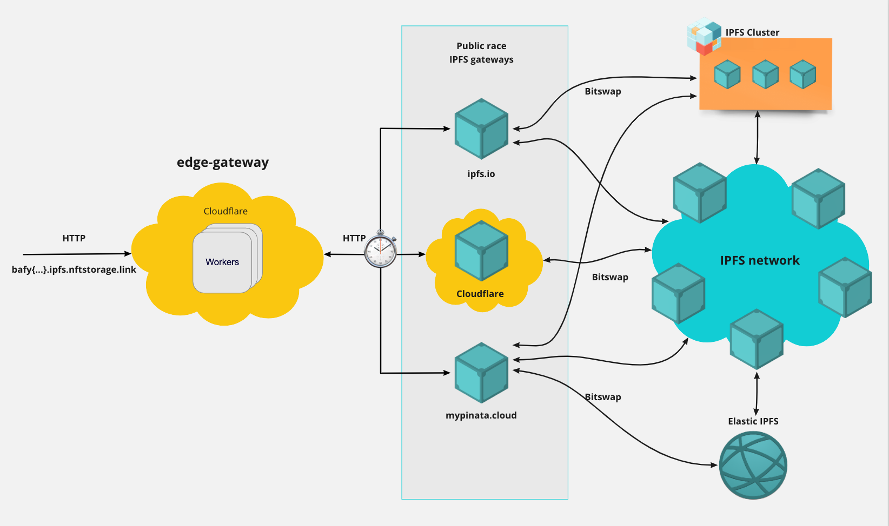
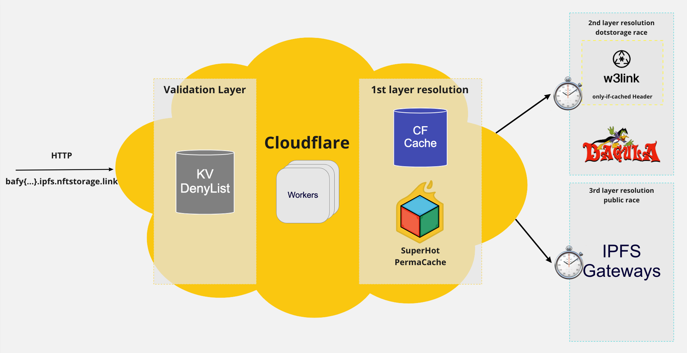

# edge gateway link for nft.storage - nftstorage.link

> The IPFS edge gateway for nft.storage is not "another gateway", but a caching layer for NFTs that sits on top of existing IPFS public gateways.

## Getting started

One time set up of your cloudflare worker subdomain for dev:

- `pnpm install` - Install the project dependencies from the monorepo root directory.
- `pnpm dev` - Run the worker in dev mode.

## Environment setup

- Add secrets

  ```sh
    wrangler secret put SENTRY_DSN --env $(whoami) # Get from Sentry
    wrangler secret put LOKI_URL --env $(whoami) # Get from Loki
    wrangler secret put LOKI_TOKEN --env $(whoami) # Get from Loki
  ```

## High level architecture

`nftstorage.link` is serverless code running across the globe to provide exceptional performance, reliability, and scale. It is powered by Cloudflare workers running as close as possible to end users.

Thanks to IPFS immutable nature, a CDN cache is an excellent fit for content retrieval as a given request URL will always return the same response. Accordingly, as a first IPFS resolution layer, `nftstorage.link` leverages Cloudflare [Cache Zone API](https://developers.cloudflare.com/workers/runtime-apis/cache) to look up for content previously cached in Cloudflare CDN (based on geolocation of the end user), as well as our SuperHot premium feature with perma-cache.

If the content is not in the first caching layers, we will trigger a dotstorage resolution where other dotstorage products cache is checked.

In the event of content not being already cached, a race with multiple IPFS gateways is performed. As soon as one gateway successfully responds, its response is forwarded to the user and added to Cloudflare Cache.



Zooming in on the actual edge gateway:



Notes:

- Cloudflare Cache is [limited](https://developers.cloudflare.com/workers/platform/limits/#cache-api-limits) to 512 MB size objects.
- SUperHot perma-cache is shared with w3s.link

## Usage

nft.storage Gateway provides IPFS path style resolutions `https://nftstorage.link/ipfs/{cid}` as follows:

```
> curl https://nftstorage.link/ipfs/bafkreidyeivj7adnnac6ljvzj2e3rd5xdw3revw4da7mx2ckrstapoupoq
Hello nft.storage! 😎
> curl https://nftstorage.link/ipfs/QmT5NvUtoM5nWFfrQdVrFtvGfKFmG7AHE8P34isapyhCxX
...
```

In practice, when nft.storage Gateway receives a IPFS path style request, it will redirect to a subdomain style resolution maintaining compliance with the [same-origin policy](https://en.wikipedia.org/wiki/Same-origin_policy). The canonical form of access `https://{CID}.ipfs.nftstorage.link/{optional path to resource}` causes the browser to interpret each returned file as being from a different origin.

```
> curl https://bafkreidyeivj7adnnac6ljvzj2e3rd5xdw3revw4da7mx2ckrstapoupoq.ipfs.nftstorage.link
Hello nft.storage! 😎
```

Please note that subdomain resolution is only supported with [CIDv1](https://docs.ipfs.io/concepts/content-addressing/#identifier-formats) in case-insensitive encoding such as Base32 or Base36. When using IPFS path resolution, the requested CID will be converted before the redirect.

### Rate limiting

nft.storage Gateway is currently rate limited at 200 requests per minute to a given IP Address. In the event of a rate limit, the IP will be blocked for 30 seconds.

## Deny List

We rely on [badbits](https://github.com/protocol/badbits.dwebops.pub) denylist together wtth our own denylist to prevent serving malicious content to the nftstorage.link users.

When new malicious content is discovered, it should be reported to [badbits](https://github.com/protocol/badbits.dwebops.pub) denylist given it is shared among multiple gateways.
